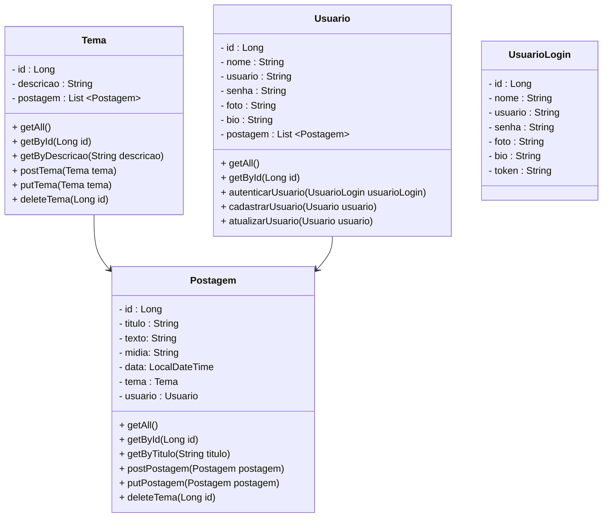

<h1 align="center">
 
 
Projeto de criação Blog Pessoal 

</h1>

<h2 Align="left"> Back-end </h2>

- Usando Spring boot para criar uma API RESTful para nosso blog pessoal.
- SpringTool + MySQL e testando no Insomnia
 
<h3 align="center">
DER: Modelo de Entidade-Relacionamento desse projeto:

  
</h3>
 
<h4 align="center"> 
	🚧  API 🚀 Em construção...  🚧
</h4>
